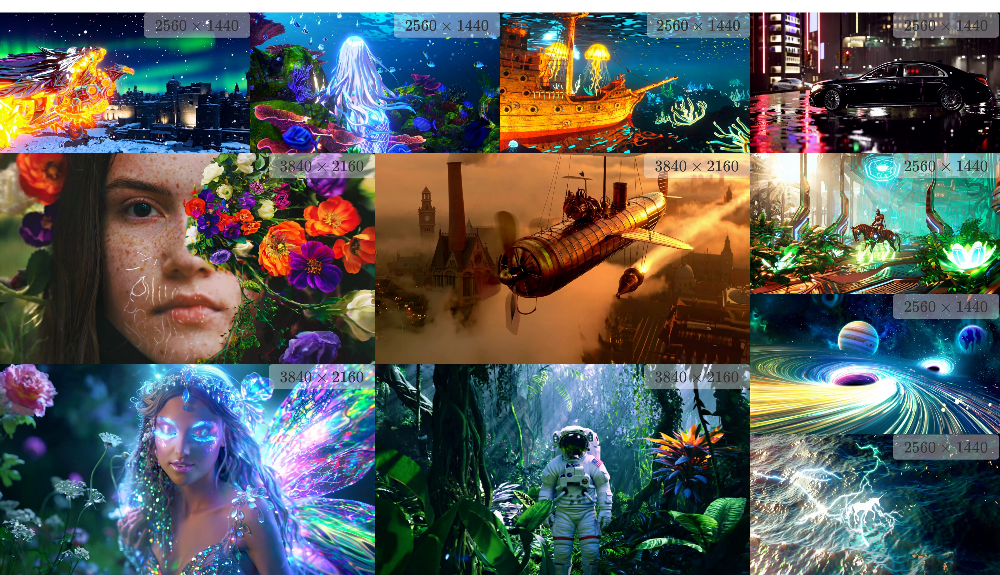
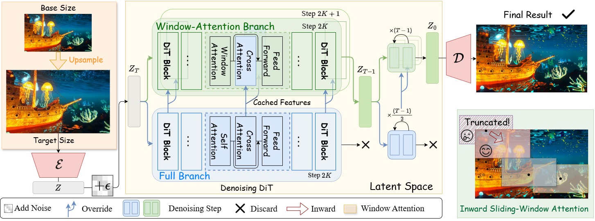

# **FreeSwim: Revisiting Sliding-Window Attention Mechanisms for Training-Free Ultra-High-Resolution Video Generation** 🎥✨

[](https://arxiv.org/abs/2511.14712)

<!-- Teaser 放在比较靠前的位置 -->


<p align="center"><em>Teaser: FreeSwim generates ultra-high-resolution videos with rich details and coherent global structure. ✨</em></p>

## **Introduction** 🚀

**FreeSwim** introduces a novel **training-free** approach for generating **ultra-high-resolution videos**, tackling the high computational cost of training large video models. Our method leverages pre-trained **Diffusion Transformers (DiTs)** at lower resolutions and synthesizes high-resolution videos efficiently without additional training. At the heart of FreeSwim is a unique **sliding-window attention mechanism** that preserves fine-grained visual details and high fidelity, addressing the inherent issues of repetitive patterns and lack of global coherence in video generation. This paper presents an innovative **dual-path pipeline** with a **cross-attention override strategy**, ensuring both local details and semantic consistency are maintained in high-resolution video generation.

🌟 **Key Highlights:**
- **Training-Free**: Generate high-quality, high-resolution videos without additional model training.
- **Efficient**: Achieves **2x speedup** with **cross-attention caching**.
- **High-Resolution**: Synthesize **4K resolution** videos with fine-grained details.

## **Key Contributions** 🎯

- **Training-Free Ultra-High-Resolution Video Generation**: 🎥 We introduce FreeSwim, a method that utilizes pre-trained DiTs to generate videos at high resolutions without the need for further training or model adaptation.
- **Inward Sliding-Window Attention**: 🔍 A critical component that maintains a local receptive field size during inference, improving detail preservation and reducing artifacts.
- **Dual-Path Architecture**: 🔄 Combines local window attention with a full-attention branch to ensure semantic accuracy and avoid content repetition.
- **Efficiency Improvements**: ⚡ Implements a cross-attention caching strategy, significantly speeding up inference without sacrificing video quality, achieving over **2x speedup**.

## **Methodology** 🧠

- **Coarse-to-Fine Generation**: 🖥️ The initial video is generated at the model's native resolution and refined through a high-resolution upsampling process.
- **Inward Sliding-Window Attention**: 🔄 Ensures that the receptive field during inference matches the training resolution, maintaining local coherence.
- **Cross-Attention Override**: 🌐 A dual-path mechanism where the full-attention branch provides global semantic guidance to the window attention branch, ensuring high-quality output without repetitive patterns.
- **Feature Reuse Strategy**: 🔁 Reduces computational costs by reusing cross-attention features from the full-attention branch during inference, enabling high-resolution generation with minimal performance loss.

<!-- 方法架构图放在 Methodology 下面 -->


<p align="center"><em>Figure: Overview of the FreeSwim framework with inward sliding-window attention, dual-path design, and cross-attention cache & reuse. 🧩</em></p>

## **Results** 🏆

**FreeSwim** outperforms previous state-of-the-art methods in both **video quality** and **efficiency** on **VBench**, with significant improvements in aesthetic appeal, imaging quality, and overall consistency. It provides a **training-free solution** for generating **4K resolution videos**, achieving fine-grained details and semantic consistency. 🌈

## **Installation** 🛠️

We recommend the following core library versions (FlexAttention behavior is sensitive to the PyTorch version):

### 1. Install **PyTorch**:
```bash
pip install torch==2.7.1 torchvision==0.22.1 torchaudio==2.7.1 --index-url https://download.pytorch.org/whl/cu118
   ```
### 2. Install **Diffusers**:
```bash
pip install diffusers==0.35.2
```

## **Usage** 📈

To run inference with FreeSwim, you need to specify the following command-line arguments:

```bash
python inference.py --mode nocache --target_height 1080 --target_width 1920
```

## **Hardware & Memory Tips** 💾

- A single 24 GB GPU (e.g., RTX 3090 / RTX 4090) is sufficient to generate 1080P, 81-frame videos with the default FreeSwim configuration.
- For the cache-based variant, if GPU memory becomes a bottleneck, the cached cross-attention features can be offloaded to the CPU to further reduce VRAM usage, at the cost of a slight slowdown in inference.

## **Citation** 📚

If you use FreeSwim in your research, please cite our paper:

```bibtex
@misc{wu2025freeswimrevisitingslidingwindowattention,
      title={FreeSwim: Revisiting Sliding-Window Attention Mechanisms for Training-Free Ultra-High-Resolution Video Generation}, 
      author={Yunfeng Wu and Jiayi Song and Zhenxiong Tan and Zihao He and Songhua Liu},
      year={2025},
      eprint={2511.14712},
      archivePrefix={arXiv},
      primaryClass={cs.CV},
      url={https://arxiv.org/abs/2511.14712}, 
}
